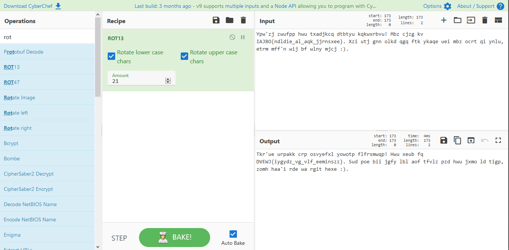
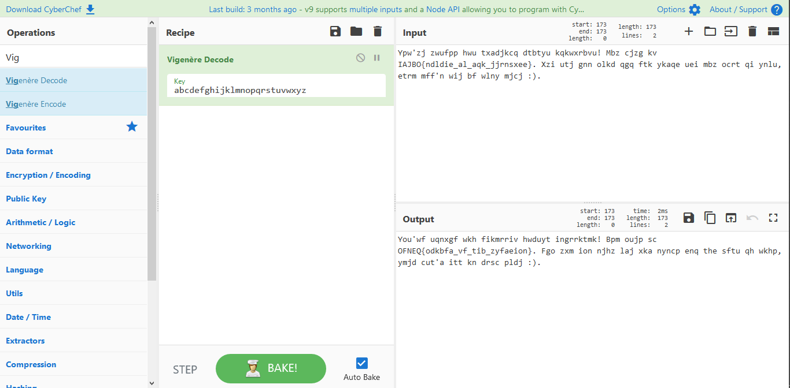
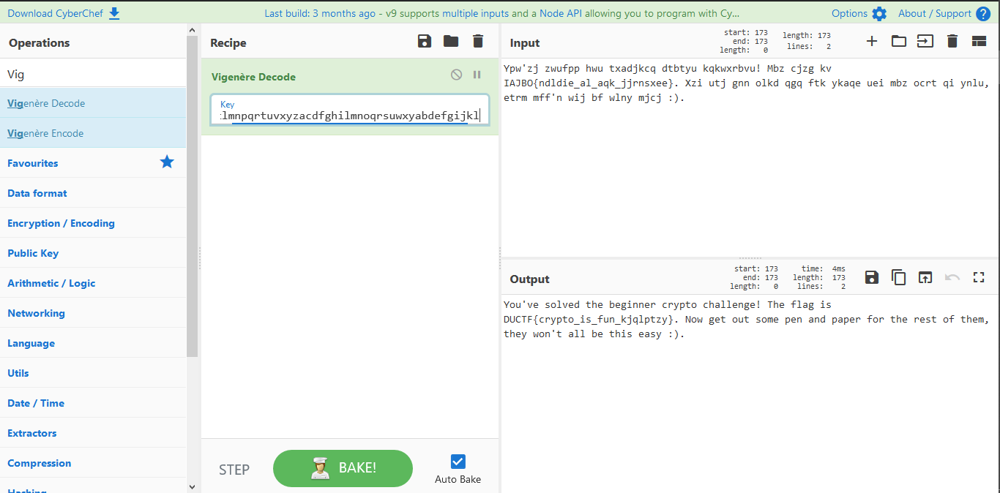

rot-i
=====

## Category: Crypto

> "ROT13 is boring!"

## Methodology

Rot-i presented me with the following text: 

Ypw'zj zwufpp hwu txadjkcq dtbtyu kqkwxrbvu! Mbz cjzg kv IAJBO{ndldie_al_aqk_jjrnsxee}. Xzi utj gnn olkd qgq ftk ykaqe uei mbz ocrt qi ynlu, etrm mff'n wij bf wlny mjcj :).

I could tell that this was ciphered text, but not how to decipher it. The first thing I did was go to [CyberChef](https://gchq.github.io/CyberChef/) and begin chipping away at it with ROT13. Immediately I discovered a problem:

This version of the ROT13 cipher has D as the first letter of the flag, meaning that the whole flag should read DUCTF{etc}. However, such is not the case, meaning that this isn't a ROT13 cipher at all. However, if you look at the next letter, you'll also notice it's just one letter further along than the actual letter (U, in this case). This led me to believe that the message was ciphered with an increasing ROT cipher (i. e. first letter is ROT0, second is ROT1, third is ROT2, etc.). A more experienced hacker likely would have knocked this out with a Python script, but I'm not a more experienced hacker, so instead I brute-forced it with a Vigenere cipher decoder. Shortly into trying to decode, I ran into another problem:

As it turns out, CyberChef automatically skips over whitespace, punctuation, and other symbols when using the Vigenere Cipher, but the flag does not! This meant I had to make a special key that skipped letters where non-letters were in the flag. It was a bit of effort, but I eventually got to this result:

That would have been a lot easier if I knew Python!

> DUCTF{crypto_is_fun_kjqlptzy}
